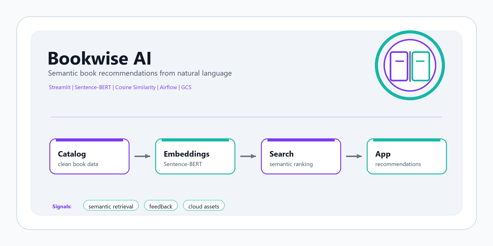
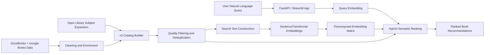

# Bookwise AI

**Semantic book recommendation system powered by SentenceTransformers, expanded catalog enrichment, hybrid semantic ranking, FastAPI, Streamlit, Airflow, and Google Cloud.**

[Live app](https://botverio.com/bookwise/) | [GitHub profile](https://github.com/sntk-76)

## Overview

Bookwise AI lets users describe the kind of book they want in natural language and returns semantically relevant titles. The core project flow is intentionally preserved: book metadata is cleaned and enriched, book texts are embedded, a user query is embedded into the same vector space, and recommendations are ranked by similarity.

The current v2 version improves the original system by widening the catalog, improving the embedding model, creating richer searchable text, filtering low-quality records, deduplicating titles, and adding a lightweight hybrid ranking layer. The result is still the same semantic recommendation product, but with better coverage and more meaningful matches for open-ended queries.

## Current v2 Improvements

| Area | Original | v2 Improvement |
| --- | --- | --- |
| Catalog size | 4,766 enriched books | 7,197 books |
| Data coverage | GoodBooks + Google Books enrichment | GoodBooks + Google Books + Open Library subject expansion |
| Embedding model | `sentence-transformers/all-MiniLM-L6-v2` | `sentence-transformers/all-MiniLM-L12-v2` |
| Search text | Mostly descriptions | Title, author, subjects, description, and publication metadata |
| Ranking | Cosine similarity only | Semantic similarity plus small lexical/title/rating boosts |
| Quality control | Basic enriched dataset | Deduping, minimum metadata checks, English/Latin title filtering |
| Runtime | Streamlit legacy app | FastAPI deployment with Streamlit kept as legacy-compatible UI |

The v2 catalog adds 2,431 Open Library records after quality filtering and deduplication. The embedding matrix is precomputed and stored as `streamlit/embeddings_v2.npy`, so inference remains fast.

## Recommendation Flow



## Technical Stack

| Layer | Tools |
| --- | --- |
| Application | FastAPI, Streamlit, Python |
| Semantic model | SentenceTransformers, `all-MiniLM-L12-v2` |
| Ranking | Normalized embeddings, cosine/dot-product similarity, lexical boosts |
| Data processing | Pandas, NumPy, Open Library API, Google Books-enriched source data |
| Orchestration | Apache Airflow DAGs for artifact upload workflows |
| Cloud and infrastructure | Google Cloud Storage, BigQuery, Terraform |
| Feedback logging | Google Sheets API, `gspread`, service-account credentials |

## Repository Structure

```text
bookwise-ai/
|-- airflow/
|   |-- dags/                       # Airflow DAGs for data artifact upload
|   |-- data/                       # Pipeline data used by Airflow tasks
|   `-- docker/                     # Local Airflow Docker Compose setup
|-- assets/
|   `-- bookwise-ai-cover.png
|-- data/                           # Legacy embedding artifact
|-- infrastructure/                 # Terraform configuration for GCP resources
|-- notebooks/                      # Original cleaning, enrichment, and embedding notebooks
|-- scripts/
|   `-- build_catalog_v2.py         # v2 catalog expansion and embedding builder
|-- streamlit/
|   |-- app.py                      # Streamlit-compatible UI
|   |-- enriched_data.csv           # Original enriched catalog
|   |-- embeddings.npy              # Original MiniLM-L6 embeddings
|   |-- catalog_v2.csv              # Expanded v2 catalog
|   |-- embeddings_v2.npy           # v2 embedding matrix
|   |-- catalog_v2_metadata.json    # v2 build metadata
|   `-- requirements.txt
|-- webapp/
|   |-- main.py                     # FastAPI production app
|   |-- recommender.py              # Shared recommendation runtime
|   `-- requirements.txt
|-- LICENSE
`-- README.md
```

## v2 Catalog Builder

Run the v2 builder with:

```bash
python scripts/build_catalog_v2.py --limit-per-subject 140 --batch-size 64
```

The builder:

1. Loads the original enriched catalog from `streamlit/enriched_data.csv`.
2. Pulls additional books from Open Library subject endpoints.
3. Normalizes title, author, subject, and description text.
4. Removes low-quality and duplicate records.
5. Filters non-Latin title records for the English-focused catalog.
6. Builds richer `search_text` for each book.
7. Encodes the catalog using `all-MiniLM-L12-v2`.
8. Saves `catalog_v2.csv`, `embeddings_v2.npy`, and `catalog_v2_metadata.json`.

Current metadata:

```text
Rows: 7,197
Base rows: 4,766
Open Library rows after filtering: 2,431
Embedding model: sentence-transformers/all-MiniLM-L12-v2
Embedding shape: 7,197 x 384
```

## Ranking Logic

The v2 recommender still uses semantic vector retrieval as the main signal. It adds small supporting boosts:

- Semantic embedding similarity: primary signal.
- Query term match in search text: small contextual boost.
- Query term match in title/author: small precision boost.
- Rating boost: small quality prior when available.

This keeps the app faithful to the original semantic recommendation concept while improving practical relevance.

## Running Locally

FastAPI:

```bash
git clone https://github.com/sntk-76/bookwise-ai.git
cd bookwise-ai

python -m venv .venv
source .venv/bin/activate
pip install -r webapp/requirements.txt

uvicorn webapp.main:app --host 127.0.0.1 --port 8602
```

Open:

```text
http://127.0.0.1:8602/bookwise/
```

On Windows PowerShell:

```powershell
python -m venv .venv
.venv\Scripts\Activate.ps1
pip install -r webapp\requirements.txt
uvicorn webapp.main:app --host 127.0.0.1 --port 8602
```

Streamlit legacy-compatible UI:

```bash
pip install -r streamlit/requirements.txt
streamlit run streamlit/app.py
```

## API Usage

```bash
curl -X POST http://127.0.0.1:8602/bookwise/api/recommend \
  -H "Content-Type: application/json" \
  -d '{"query":"space opera with politics and artificial intelligence","top_n":5}'
```

The response includes:

- `version`: active catalog version.
- `catalog_size`: number of searchable books.
- `embedding_model`: active SentenceTransformer model.
- `recommendations`: ranked books with match score, semantic score, metadata, subjects, and links.

## Data Engineering Workflow

The project still includes Airflow DAGs for managing data artifacts:

| DAG | Purpose |
| --- | --- |
| `upload_raw_data` | Uploads the source dataset to GCS |
| `upload_cleaned_raw_data` | Uploads the cleaned intermediate dataset |
| `upload_enriched_data` | Uploads the enriched recommendation catalog |
| `upload_embeddings` | Uploads the generated embedding matrix |

Terraform provisions the GCP storage and warehouse foundation:

- Google Cloud Storage bucket for versioned data assets.
- BigQuery datasets for raw and clean analytical layers.
- Region and project configuration managed through variables.

## Project Highlights

- Preserves the original semantic recommendation workflow.
- Expands recommendation coverage beyond the limited original corpus.
- Uses a stronger embedding model while keeping runtime practical.
- Improves preprocessing with richer text construction and quality filtering.
- Uses shared runtime logic for both FastAPI and Streamlit.
- Keeps inference efficient through precomputed embeddings.
- Provides a clear path for future larger-scale vector search with FAISS or ScaNN.

## Future Improvements

- Add FAISS or ScaNN for larger catalogs.
- Add explicit genre, language, rating, and publication-year filters.
- Add offline evaluation with curated query-to-book relevance sets.
- Add user feedback analytics from logged helpful/not-helpful responses.
- Add periodic catalog refresh jobs through Airflow.
- Add cross-encoder reranking for the top 50 candidates.

## License

This project is licensed under the [MIT License](LICENSE).

## Acknowledgements

- [GoodBooks-10K Dataset](https://www.kaggle.com/datasets/zygmunt/goodbooks-10k)
- [Google Books API](https://developers.google.com/books)
- [Open Library](https://openlibrary.org/)
- [SentenceTransformers](https://www.sbert.net/)
- [FastAPI](https://fastapi.tiangolo.com/)
- [Streamlit](https://streamlit.io/)
- [Apache Airflow](https://airflow.apache.org/)
- [Terraform](https://www.terraform.io/)
