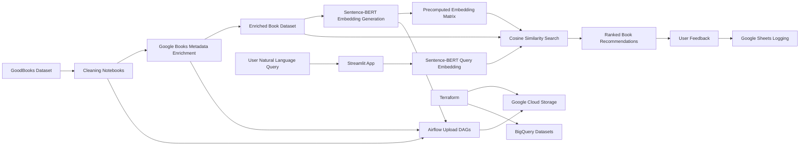

# Bookwise AI

**Semantic book recommendation system powered by Sentence-BERT, Streamlit, Airflow, and Google Cloud.**

[Live app](https://bookwise-ai-recommendation.streamlit.app/) | [GitHub profile](https://github.com/sntk-76)

## Overview

Bookwise AI is an end-to-end recommendation platform that lets users describe the kind of book they want in natural language and returns semantically relevant titles. Instead of relying only on keyword matching, the system converts both user intent and enriched book descriptions into dense vector embeddings, then ranks candidates by semantic similarity.

The project demonstrates a complete applied AI workflow: dataset cleaning, metadata enrichment, embedding generation, vector-based retrieval, Streamlit deployment, feedback logging, Airflow-based data asset orchestration, and Terraform-managed Google Cloud infrastructure.

## Why This Project Matters

Most simple recommender demos depend on explicit genres, tags, or manual filters. Bookwise AI is designed around a more realistic discovery problem: a user may say "I want a slow, emotional novel about memory and family" without knowing the exact category or title. The system handles that open-ended intent by mapping the query into the same semantic space as the book corpus.

For recruiters and technical reviewers, this project highlights practical strengths across machine learning, data engineering, application development, and cloud-aware deployment.

## Core Capabilities

| Capability | Implementation |
| --- | --- |
| Natural language search | Free-form user queries are embedded with `sentence-transformers/all-MiniLM-L6-v2`. |
| Semantic ranking | Cosine similarity compares the query vector against precomputed book embeddings. |
| Metadata enrichment | Book records are cleaned and enriched with descriptions, authors, ratings, publication metadata, and image URLs. |
| Interactive product layer | Streamlit app displays recommendations, similarity scores, cover images, descriptions, and external search links. |
| Feedback collection | Query and feedback events are written to Google Sheets through a service-account workflow. |
| Data orchestration | Airflow DAGs upload raw, cleaned, enriched, and embedding artifacts to GCS. |
| Cloud infrastructure | Terraform provisions Google Cloud Storage and BigQuery datasets for the project data layer. |

## Architecture



## Technical Stack

| Layer | Tools |
| --- | --- |
| Application | Streamlit, Python |
| Recommendation logic | SentenceTransformers, `all-MiniLM-L6-v2`, cosine similarity, NumPy |
| Data processing | Pandas, notebooks, Google Books API enrichment |
| Orchestration | Apache Airflow, Docker Compose |
| Cloud and infrastructure | Google Cloud Storage, BigQuery, Terraform |
| Feedback logging | Google Sheets API, `gspread`, service-account credentials |

## Repository Structure

```text
bookwise-ai/
|-- airflow/
|   |-- dags/                 # Airflow DAGs for uploading data artifacts
|   |-- data/                 # Pipeline data used by Airflow tasks
|   `-- docker/               # Local Airflow Docker Compose setup
|-- assets/
|   `-- bookwise-ai-cover.png # README cover image
|-- data/                     # Project data and embeddings
|-- infrastructure/           # Terraform configuration for GCP resources
|-- notebooks/                # Cleaning, enrichment, embedding, and modeling notebooks
|-- streamlit/
|   |-- app.py                # Streamlit recommendation app
|   |-- enriched_data.csv     # App-ready enriched book catalog
|   |-- embeddings.npy        # Precomputed semantic vectors
|   `-- requirements.txt      # App dependencies
|-- LICENSE
`-- README.md
```

## Recommendation Workflow

1. Clean the source book dataset and retain the fields that matter for discovery.
2. Enrich each book with descriptive metadata through the Google Books API.
3. Encode book descriptions with Sentence-BERT and persist the embedding matrix.
4. Load the enriched catalog and embeddings in the Streamlit application.
5. Encode the user's query with the same embedding model.
6. Rank books with cosine similarity and return the top recommendations.
7. Log user queries and feedback for future product and model analysis.

## Data Engineering Workflow

The project includes Airflow DAGs for managing key data artifacts:

| DAG | Purpose |
| --- | --- |
| `upload_raw_data` | Uploads the source dataset to GCS. |
| `upload_cleaned_raw_data` | Uploads the cleaned intermediate dataset. |
| `upload_enriched_data` | Uploads the enriched recommendation catalog. |
| `upload_embeddings` | Uploads the generated embedding matrix. |

Terraform provisions the GCP storage and warehouse foundation:

- Google Cloud Storage bucket for versioned data assets.
- BigQuery datasets for raw and clean analytical layers.
- Region and project configuration managed through variables.

## Running Locally

```bash
git clone https://github.com/sntk-76/bookwise-ai.git
cd bookwise-ai

python -m venv .venv
.venv\Scripts\activate
pip install -r streamlit/requirements.txt

streamlit run streamlit/app.py
```

On macOS/Linux, activate the environment with:

```bash
source .venv/bin/activate
```

Feedback logging requires Streamlit secrets containing the Google service-account configuration expected by `streamlit/app.py`.

## Running Airflow

```bash
cd airflow/docker
docker-compose up
```

Then open the Airflow UI at `http://localhost:8080` and trigger the upload DAGs as needed.

## Deploying Infrastructure

```bash
cd infrastructure
terraform init
terraform plan
terraform apply
```

The Terraform configuration expects Google Cloud credentials and project values to be available through the variables in `infrastructure/variables.tf`.

## Project Highlights

- Uses semantic retrieval instead of keyword-only matching.
- Separates data preparation, embedding generation, application serving, and cloud upload workflows.
- Keeps inference efficient by using precomputed book embeddings.
- Adds a product feedback loop through Google Sheets logging.
- Demonstrates both ML application delivery and data engineering discipline in one coherent project.

## Future Improvements

- Replace full-matrix cosine search with FAISS, Annoy, or ScaNN for larger catalogs.
- Add genre, language, rating, and publication-year filters.
- Introduce user sessions and personalized recommendation history.
- Build a feedback analytics dashboard from logged query and satisfaction data.
- Containerize the Streamlit app for deployment to a managed cloud runtime.

## License

This project is licensed under the [MIT License](LICENSE).

## Acknowledgements

- [GoodBooks-10K Dataset](https://www.kaggle.com/datasets/zygmunt/goodbooks-10k)
- [Google Books API](https://developers.google.com/books)
- [SentenceTransformers](https://www.sbert.net/)
- [Streamlit](https://streamlit.io/)
- [Apache Airflow](https://airflow.apache.org/)
- [Terraform](https://www.terraform.io/)
